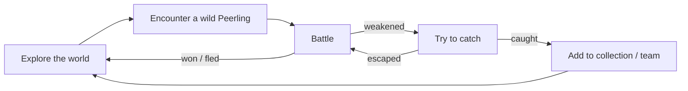

# Core Gameplay Loop

> What the player does, minute to minute and session to session. Each step links
> to its canonical page.

## One-time: onboarding

[accepted] Every new player creates their [player character](player-character.md)
and their starting Peerling by describing it. See [onboarding](onboarding.md).

## The loop

[accepted] Travel around a procedurally generated world looking for Peerlings to
fight and catch.

| Step | Canonical page | Provenance |
|------|----------------|------------|
| Explore | [exploration](exploration.md) | [accepted] |
| Encounter | [encounters](encounters.md) | [accepted] |
| Battle | [battle](battle.md) | [accepted] |
| Catch | [catching](catching.md) | [accepted] |

## The social layer

[accepted] The world is shared ([D-0008](../decisions/D-0008-shared-multiplayer-world.md)).
Around the core loop, players meet each other, [battle](pvp-battles.md) and
[trade](trading.md). See [multiplayer](multiplayer.md).

## Motivations (proposed)

[proposed] Why players keep playing:
- **Discovery** — every wild Peerling is another player's imagination; there is
  always something never seen before.
- **Collection** — catch as many different species as possible (a "Peerdex"
  of everything you have seen and caught).
- **Mastery** — build a team that handles every type matchup; reach harder
  areas further from the start; beat other players.
- **Exchange** — trade to get species you can't find yourself, or to spread
  your own creation.
- **Pride** — see how your own creation spreads through the world
  ([Q-021](../open-questions.md#q-021)).

## Open questions

[Q-030](../open-questions.md#q-030)
