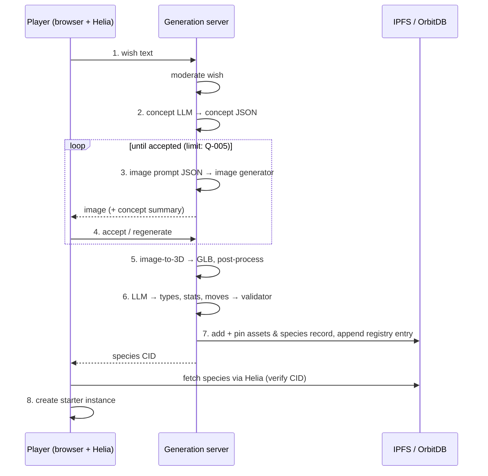

# Peerling Creation Pipeline

> How a player's free-text wish becomes a published Peerling
> [species](../glossary.md#species): concept → image → player review → 3D model →
> type, stats and moves → publish to IPFS and the registry. This page is the
> canonical description of the pipeline's stages and their order.

## Why it works this way

- [accepted] All Peerlings are user-generated ([D-0002](../decisions/D-0002-all-peerlings-user-generated.md)).
  The player only describes; AI models do the art, so anyone can create.
- [accepted] The player keeps creative control at the most visible point — the
  image — by accepting or regenerating it.
- [accepted] Battle data (type, moves) is generated within fixed rules so a
  clever description cannot produce an overpowered creature.
- [proposed] The *art style* is fixed by the system, not the player, so every
  Peerling looks like it belongs in the same game. The player controls *what*
  the creature is; the pipeline controls *how* it is drawn.

## Stages

| # | Stage | Runs on | Input | Output | Provenance |
|---|-------|---------|-------|--------|------------|
| 1 | Wish | client | player text | wish text | [accepted] |
| 2 | Concept | server: concept LLM | wish | [concept](../glossary.md#concept) JSON | [accepted] |
| 3 | Image | server: image generator | concept → structured (JSON) image prompt | 2D image | [accepted] |
| 4 | Review | client | image | accept / regenerate | [accepted] |
| 5 | 3D model | server: image-to-3D | accepted image | 3D model (GLB) | [accepted] |
| 6 | Battle profile | server: concept LLM + validator | concept, image description | types, stats, moves | [accepted] (stats: [proposed]) |
| 7 | Publish | server (+ client, see [Q-003](../open-questions.md#q-003)) | everything above | species record on IPFS + registry entry | [accepted] |
| 8 | Starter | client | published species CID | [starter](../glossary.md#starter) instance in the player's save | [accepted] |



### Stage 1 — Wish
The player describes the Peerling they want in free text (e.g. *"a small
sleepy fox made of moss that carries a lantern"*). [proposed] The client shows
a few example wishes and a character limit. [proposed] The wish is sent with the
player's identity ([Q-014](../open-questions.md#q-014)) so the server can apply
rate limits.

### Stage 2 — Concept
The [concept LLM](../glossary.md#concept-llm) turns the wish into a structured
concept. [proposed] Concept fields:

| Field | Description |
|-------|-------------|
| `nameSuggestions` | 3 short candidate names ([Q-018](../open-questions.md#q-018)) |
| `summary` | One sentence describing the creature |
| `lore` | 2–4 sentences of flavor text shown in-game |
| `appearance` | Structured visual description: body plan, size class, colors, materials/textures, distinctive features, pose |
| `temperament` | Short personality description (flavor; may inform animation style) |
| `typeHints` | Candidate [types](types.md) — see [Q-004](../open-questions.md#q-004) |

The concept must stay faithful to the wish; the LLM elaborates, it does not
replace the player's idea.

### Stage 3 — Image
The concept's `appearance` is converted to a structured (JSON) prompt for the
image generator (the brief names FLUX.2 or similar models that accept JSON
prompts for precise control). [proposed] The prompt has two parts:

- **House-style block (fixed by the system):** art style, lighting, camera,
  and constraints that make the image a good input for image-to-3D: exactly one
  creature, full body visible, centered, three-quarter front view, plain
  neutral background, no text, no ground shadows or props cut by the frame.
- **Subject block (from the concept):** the creature itself.

The seed and the full prompt are recorded for provenance.

### Stage 4 — Review
The player sees the image and either **accepts** it or **regenerates**.
[proposed] Regenerate uses a new seed; the player may adjust their wish before
regenerating. Limits: [Q-005](../open-questions.md#q-005).

### Stage 5 — 3D model
The accepted image goes to the self-hosted image-to-3D generator (the brief
names TRELLIS.2 or similar). [proposed] Steps:
1. Background removal / subject matting of the image.
2. Image-to-3D generation → textured mesh.
3. Post-processing: normalize scale (fits a unit bounding box), orientation
   (faces +Z, up is +Y), place the lowest point at y = 0, decimate and compress
   to the asset budget ([Q-016](../open-questions.md#q-016)), export as binary
   glTF (`.glb`).
4. Render a small thumbnail of the model for lists and menus.

The resulting mesh is static and unrigged; animation is covered by
[Q-015](../open-questions.md#q-015). Whether the player reviews the 3D model:
[Q-006](../open-questions.md#q-006).

### Stage 6 — Battle profile
[accepted] The LLM assigns the Peerling's [type](types.md) from the predefined
type list, and creates [moves](moves.md) that follow the move templates.
[proposed] It also distributes base stats within the fixed stat budget (see
[peerling-species](peerling-species.md#stats)). The LLM *proposes*; a
deterministic **validator** on the server checks every rule and rejects (and
re-prompts) or clamps anything out of bounds. The validator, not the LLM, is the
authority on balance.

### Stage 7 — Publish
The species data and its assets are put on IPFS and the species is added to the
[registry](../tech/orbitdb-registry.md). [proposed] Order:
1. Add the image, model and thumbnail to IPFS → CIDs.
2. Build the [species record](peerling-species.md#species-record) referencing
   those CIDs; sign it ([attestation](../glossary.md#attestation)); add it to
   IPFS → the species CID.
3. Pin everything on the server.
4. Append the registry entry ([D-0005](../decisions/D-0005-server-sole-registry-writer.md)).
5. Return the species CID to the client.

Who performs the IPFS add (server or client): [Q-003](../open-questions.md#q-003).

### Stage 8 — Starter
The client fetches the species record by CID through its own Helia node,
verifies it, and creates the player's starter [instance](../glossary.md#peerling-instance)
in its save ([D-0006](../decisions/D-0006-species-vs-instance.md)).

## Job handling

[proposed] Stages 2, 3, 5 and 6 are GPU jobs that can take from seconds to
minutes. The pipeline is modelled as a server-side **creation job** with a state
machine; the client follows its progress.

```
WISH_SUBMITTED → CONCEPT_READY → IMAGE_READY ⇄ (regenerate)
  → IMAGE_ACCEPTED → MODEL_READY → PROFILE_READY → PUBLISHED
any state → REJECTED (moderation) | FAILED (error, retryable) | EXPIRED (abandoned)
```

[proposed] Onboarding overlaps waiting time with other activity (e.g. character
creation runs while the 3D model generates) — see
[onboarding](../gameplay/onboarding.md).

## Requirements

- **CRE-001** [accepted] Every Peerling species MUST be created through this pipeline; there are no hand-authored species.
- **CRE-002** [accepted] The player MUST describe the Peerling in free text; the concept MUST be generated from that description by the self-hosted LLM.
- **CRE-003** [accepted] The image MUST be generated from the concept by the image generator, and the player MUST be able to accept it or request a regeneration.
- **CRE-004** [accepted] The 3D model MUST be generated from the accepted image by the image-to-3D generator, and MUST be the asset used to show the Peerling in-game.
- **CRE-005** [accepted] Each species' type(s) MUST come from the predefined type list in [types](types.md).
- **CRE-006** [accepted] Each move MUST conform to a move template in [moves](moves.md).
- **CRE-007** [accepted] The species data and 3D model MUST be stored on IPFS and the species MUST be added to the OrbitDB registry.
- **CRE-008** [proposed] All LLM outputs MUST be requested as JSON and validated against a schema; invalid output MUST be retried, never passed on.
- **CRE-009** [proposed] A deterministic server-side validator MUST check types, stats and moves against the rules before publishing; LLM output alone MUST NOT be trusted for balance.
- **CRE-010** [proposed] The image prompt MUST include the fixed house-style block so all Peerlings share one art style and produce clean image-to-3D input.
- **CRE-011** [proposed] Wish text, chosen name and generated image MUST pass [moderation](moderation.md) before the species is published.
- **CRE-012** [proposed] Every species record MUST include provenance: wish text, concept, image prompt, seeds, and model names/versions used at each stage.
- **CRE-013** [proposed] The 3D model MUST be post-processed to a normalized scale, orientation and ground position, and MUST fit the asset budget ([Q-016](../open-questions.md#q-016)).
- **CRE-014** [proposed] The pipeline MUST run as a resumable server-side job; the client MUST show progress and MUST be able to reconnect to an in-progress job after a page reload.
- **CRE-015** [proposed] A published species MUST be immutable; there is no edit operation.

## Open questions

[Q-001](../open-questions.md#q-001) ·
[Q-003](../open-questions.md#q-003) ·
[Q-004](../open-questions.md#q-004) ·
[Q-005](../open-questions.md#q-005) ·
[Q-006](../open-questions.md#q-006) ·
[Q-007](../open-questions.md#q-007) ·
[Q-015](../open-questions.md#q-015) ·
[Q-016](../open-questions.md#q-016) ·
[Q-018](../open-questions.md#q-018)

## See also

- [Peerling species & data model](peerling-species.md)
- [Generation server](../tech/generation-server.md)
- [Onboarding](../gameplay/onboarding.md)
