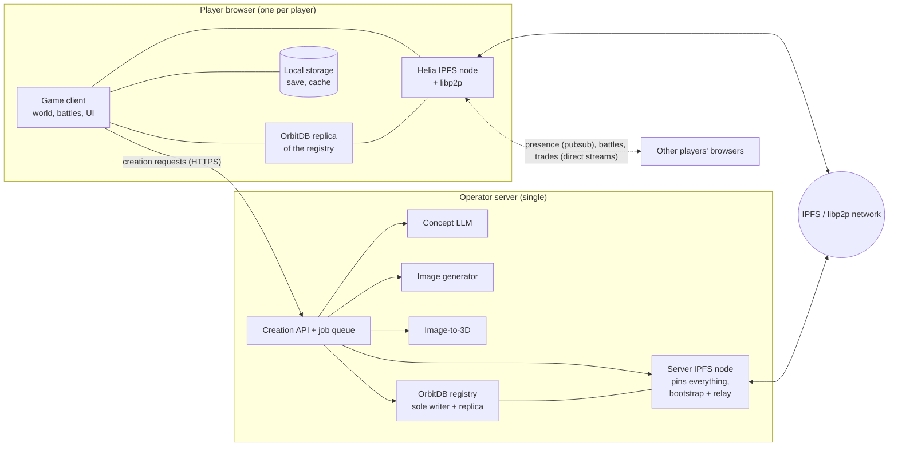

# System Architecture

> The components of Peerlings and how they talk to each other: browser clients
> that are IPFS/libp2p nodes, one operator server for generation and pinning,
> and the IPFS network, OrbitDB registry and pubsub connecting them.

## Components

| Component | Responsibility | Canonical page | Provenance |
|-----------|----------------|----------------|------------|
| Game client | Runs the game in the browser | [gameplay](../gameplay/core-loop.md) | [accepted] |
| Helia node | Each player is an IPFS node that downloads, serves and publishes content | [ipfs-helia](ipfs-helia.md) | [accepted] |
| OrbitDB registry | Database of all Peerling species; only the server writes | [orbitdb-registry](orbitdb-registry.md) | [accepted] |
| Generation server | LLM, image gen, image-to-3D, pinning, registry writer | [generation-server](generation-server.md) | [accepted] |
| Realtime networking | Presence, PvP and trades between players over libp2p | [realtime-networking](realtime-networking.md) | [accepted] (mechanism: [proposed]) |
| Player data | Per-player OrbitDB save log, identity key recovery, ownership ledger | [player-data](player-data.md) | [accepted] |

## Key data flows

1. **Creation**: client ⇄ server over HTTPS for the
   [creation pipeline](../peerlings/creation-pipeline.md). The client publishes
   the result to IPFS, and the server pins it and lists it in the registry.
2. **Registry sync**: every client replicates the registry from peers and the
   server via OrbitDB.
3. **Asset fetch**: when a species is needed (encounter, collection, an
   opponent's team), the client fetches its record and assets by CID via Helia,
   from whichever peers have them, and verifies them.
4. **Serving**: clients provide the content they hold to other players.
5. **Player interaction**: presence over region pubsub topics; battles and
   trades over direct libp2p streams ([realtime-networking](realtime-networking.md)).

## Trust model

- [accepted] The server is trusted for *what is a valid species*. It is the
  only registry writer ([D-0005](../decisions/D-0005-server-sole-registry-writer.md)).
  [proposed] It also signs species records.
- [proposed] Peers are untrusted for *content*. Everything fetched from peers is
  verified by CID, and species records by attestation.
- [proposed] Peers are untrusted for *claims about their own state* (levels,
  ownership, positions). With a shared world, PvP and trading
  ([D-0008](../decisions/D-0008-shared-multiplayer-world.md)), a player's save
  can affect other players, so interactions are designed to need as little
  trust as possible: verifiable species, normalized PvP levels, commit-reveal
  turns.
- [accepted] The server is trusted to vouch for *catches and ownership*: it
  verifies catches by replay and keeps the ownership ledger, so peers can trust
  Peerlings in trades and PvP ([D-0009](../decisions/D-0009-player-data-on-orbitdb.md),
  [player-data](player-data.md)).

## Requirements

- **ARC-001** [accepted] The game MUST run in a web browser without installation.
- **ARC-002** [accepted] Each client MUST run a Helia IPFS node ([D-0003](../decisions/D-0003-browser-client-is-ipfs-node.md)).
- **ARC-003** [accepted] A single operator server MUST host the generation models and pin all game content ([D-0004](../decisions/D-0004-single-operator-server.md)).
- **ARC-004** [proposed] Apart from creation, the game MUST remain playable using peers and local cache when the server is unreachable, as far as content and connectivity allow ([Q-022](../open-questions.md#q-022)).
- **ARC-005** [proposed] The client MUST NOT depend on any centralized service other than the operator server (and optionally public IPFS infrastructure such as bootstrap nodes or trustless gateways).
- **ARC-006** [proposed] A client MUST NOT trust another client's claims without verification; data received from peers MUST be verified by CID, signature or protocol design (see trust model).

## Open questions

[Q-022](../open-questions.md#q-022)

## See also

- [IPFS showcase](ipfs-showcase.md) · [Realtime networking](realtime-networking.md)
