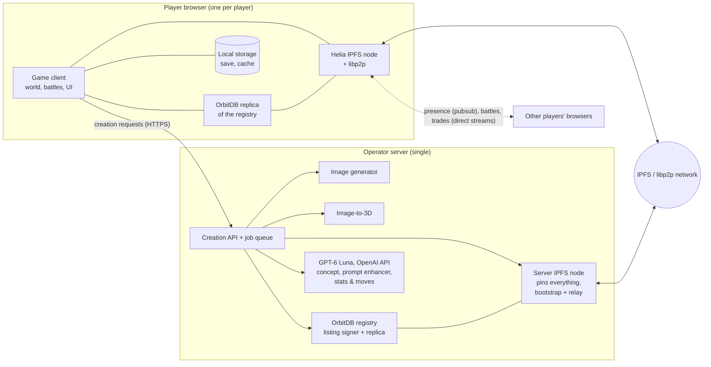

# System Architecture

> The components of Peerlings and how they talk to each other: browser clients
> that are IPFS/libp2p nodes, one operator server for generation and pinning,
> and the IPFS network, OrbitDB registry and pubsub connecting them.

## Components

| Component | Responsibility | Canonical page | Provenance |
|-----------|----------------|----------------|------------|
| Game client | Runs the game in the browser | [gameplay](../gameplay/core-loop.md) | [accepted] |
| Helia node | Each player is an IPFS node that downloads, serves and publishes content | [ipfs-helia](ipfs-helia.md) | [accepted] |
| OrbitDB registry | Database of all Peerling species; players append entries signed by the server | [orbitdb-registry](orbitdb-registry.md) | [accepted] |
| Generation server | Image gen, image-to-3D, LLM calls, pinning, listing signer | [generation-server](generation-server.md) | [accepted] |
| GPT-6 Luna | External LLM for every LLM step: concept, prompt enhancer, stats and moves; called only by the server | [generation-server](generation-server.md), [image-prompting](../peerlings/image-prompting.md) | [accepted] |
| Realtime networking | Presence, PvP and trades between players over libp2p | [realtime-networking](realtime-networking.md) | [accepted] (mechanism: [accepted]) |
| Player data | Per-player OrbitDB save log, identity key recovery, transfer log, peer verification | [player-data](player-data.md) | [accepted] |
| Data and message formats | Exact records, pubsub and stream messages, HTTP API | [data-formats](data-formats.md), [protocols](protocols.md), [creation-api](creation-api.md) | [accepted] |
| Platform technologies | WebTransport, WebRTC, IPv6, WebGPU, OPFS, … | [tech-stack](tech-stack.md) | [accepted] principle ([D-0011](../decisions/D-0011-modern-web-platform-first.md)) |

## Key data flows

1. **Creation**: client ⇄ server over HTTPS for the
   [creation pipeline](../peerlings/creation-pipeline.md). The client publishes
   the result to IPFS; the server pins it and signs its registry listing, which
   the client appends.
2. **Registry sync**: a new client starts from the compact registry index, then
   replicates the full registry from peers and the server via OrbitDB in the
   background ([network-performance](network-performance.md#1-registry-index)).
3. **Asset fetch**: when a species is needed (encounter, collection, an
   opponent's team), the client fetches its record and assets by CID via Helia,
   from whichever peers have them, and verifies them.
4. **Serving**: clients provide the content they hold to other players.
5. **Player interaction**: presence over region pubsub topics; battles and
   trades over direct libp2p streams ([realtime-networking](realtime-networking.md)).

## Trust model

- [accepted] The server is trusted for *what is a valid species*: it signs
  every registry listing and every species record, and only signed entries are
  accepted ([D-0013](../decisions/D-0013-peer-verified-registry-catches-trades.md)). It is also trusted for the origin of starters and
  Creation Shrine Peerlings, and for epoch records (with a drand-based fallback).
- [accepted] Peers are untrusted for *content*. Everything fetched from peers is
  verified by CID, and species records by the server's signature.
- [accepted] Peers are untrusted for *claims about their own Peerlings*. Any
  player can check another's Peerling themselves: catches by replaying them,
  ownership by following the signed transfer chain
  ([player-data § Verification](player-data.md#verification)). No server is
  needed for this, so trades and PvP work while the server is offline.
- [accepted] What can't be prevented without global agreement is detected
  instead: a player who gives the same Peerling to two others is exposed by
  their own two signatures and flagged.
- [accepted] As a speed-up, the server is also trusted for its published
  summaries: verification checkpoints, the registry index, species stats, the
  ownership index (including its list of flagged players) and the first wild
  finder of each species ([D-0023](../decisions/D-0023-network-performance.md)).
  Anyone can still check the underlying data in full.

## Requirements

- **ARC-001** [accepted] The game MUST run in a web browser without installation.
- **ARC-002** [accepted] Each client MUST run a Helia IPFS node ([D-0003](../decisions/D-0003-browser-client-is-ipfs-node.md)).
- **ARC-003** [accepted] A single operator server MUST host the generation models and pin all game content ([D-0004](../decisions/D-0004-single-operator-server.md)).
- **ARC-004** [accepted] Apart from creation, the game MUST remain playable using peers and local cache when the server is unreachable, as far as content and connectivity allow ([resilience](resilience.md)).
- **ARC-005** [accepted] The client MUST NOT depend on any centralized service other than the operator server (and optionally public IPFS infrastructure such as bootstrap nodes, relays, delegated routing or trustless gateways, and public drand endpoints).
- **ARC-006** [accepted] A client MUST NOT trust another client's claims without verification; data received from peers MUST be verified by CID, signature or protocol design (see trust model).

## Open questions

_None at the moment._

## See also

- [IPFS showcase](ipfs-showcase.md) · [Realtime networking](realtime-networking.md)
