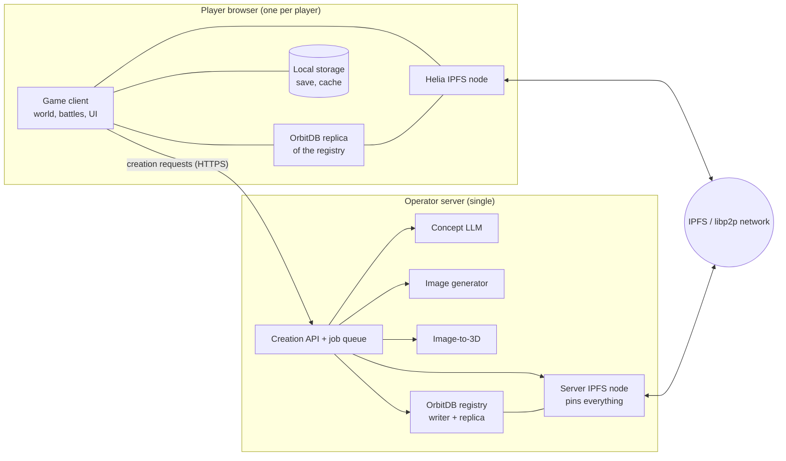

# System Architecture

> The components of Peerlings and how they talk to each other: browser clients
> that are IPFS nodes, one operator server for generation and pinning, and the
> IPFS network + OrbitDB registry connecting them.

## Components

| Component | Responsibility | Canonical page | Provenance |
|-----------|----------------|----------------|------------|
| Game client | Runs the game in the browser | [gameplay](../gameplay/core-loop.md) | [accepted] |
| Helia node | Each player is an IPFS node that downloads and serves content | [ipfs-helia](ipfs-helia.md) | [accepted] |
| OrbitDB registry | Database of all Peerling species | [orbitdb-registry](orbitdb-registry.md) | [accepted] |
| Generation server | LLM, image gen, image-to-3D, pinning | [generation-server](generation-server.md) | [accepted] |
| Local storage | Player save, identity key, content cache | [player-character](../gameplay/player-character.md) | [proposed] |

## Key data flows

1. **Creation** — client ⇄ server over HTTPS for the
   [creation pipeline](../peerlings/creation-pipeline.md); results land on IPFS
   and in the registry.
2. **Registry sync** — every client replicates the registry from peers and the
   server via OrbitDB.
3. **Asset fetch** — when a species is needed (encounter, collection), the
   client fetches its record and assets by CID via Helia, from whichever peers
   have them, and verifies them.
4. **Serving** — clients provide the content they hold to other players.

## Trust model

[proposed]
- The server is trusted for *what is a valid species* (it is the only registry
  writer and signs records — [D-0005](../decisions/D-0005-server-sole-registry-writer.md)).
- Peers are untrusted for *content*: everything fetched from peers is verified
  by CID, and species records by attestation.
- Players are untrusted for their *own save* only in so far as cheating in
  single-player hurts nobody; anything affecting other players (registry, future
  multiplayer) must not trust client data.

## Requirements

- **ARC-001** [accepted] The game MUST run in a web browser without installation.
- **ARC-002** [accepted] Each client MUST run a Helia IPFS node ([D-0003](../decisions/D-0003-browser-client-is-ipfs-node.md)).
- **ARC-003** [accepted] A single operator server MUST host the generation models and pin all game content ([D-0004](../decisions/D-0004-single-operator-server.md)).
- **ARC-004** [proposed] Apart from creation, the game MUST remain playable using peers and local cache when the server is unreachable, as far as content is available ([Q-022](../open-questions.md#q-022)).
- **ARC-005** [proposed] The client MUST NOT depend on any centralized service other than the operator server (and optionally public IPFS infrastructure such as bootstrap nodes or trustless gateways).

## Open questions

[Q-013](../open-questions.md#q-013) · [Q-022](../open-questions.md#q-022)

## See also

- [IPFS showcase](ipfs-showcase.md)
